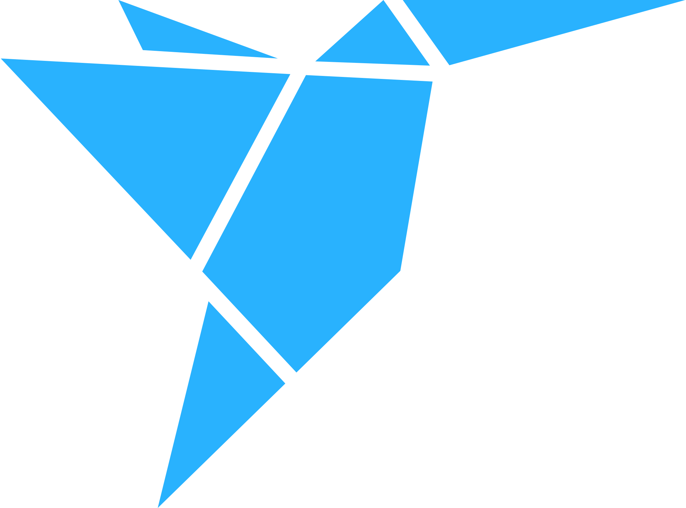

   

<h1 align="center">Welcome, I am Omar Ayman Gaber</h1>

Experienced PHP Laravel Full-Stack Engineer and a Bachelor’s degree student in Computer Science with a focus on building secure, scalable, and user-friendly web applications. With Front-End and Back-End development expertise, I prioritize clean code, intuitive design, and efficient solutions. Committed to continuous learning and delivering impactful results.

## My Resume:

<h3 align="center">For more information, you can check my resume from this link: <a href="https://flowcv.com/resume/lfcw6ipo72">Omar_Ayman_Resume</a></h3>

## Programming Languages:

  

## Tools and Technologies:

### Web Development Technologies

  

### Development Tools

  

## Freelancing Websites:

## Social Media Accounts:

## Problem-Solving Websites:

